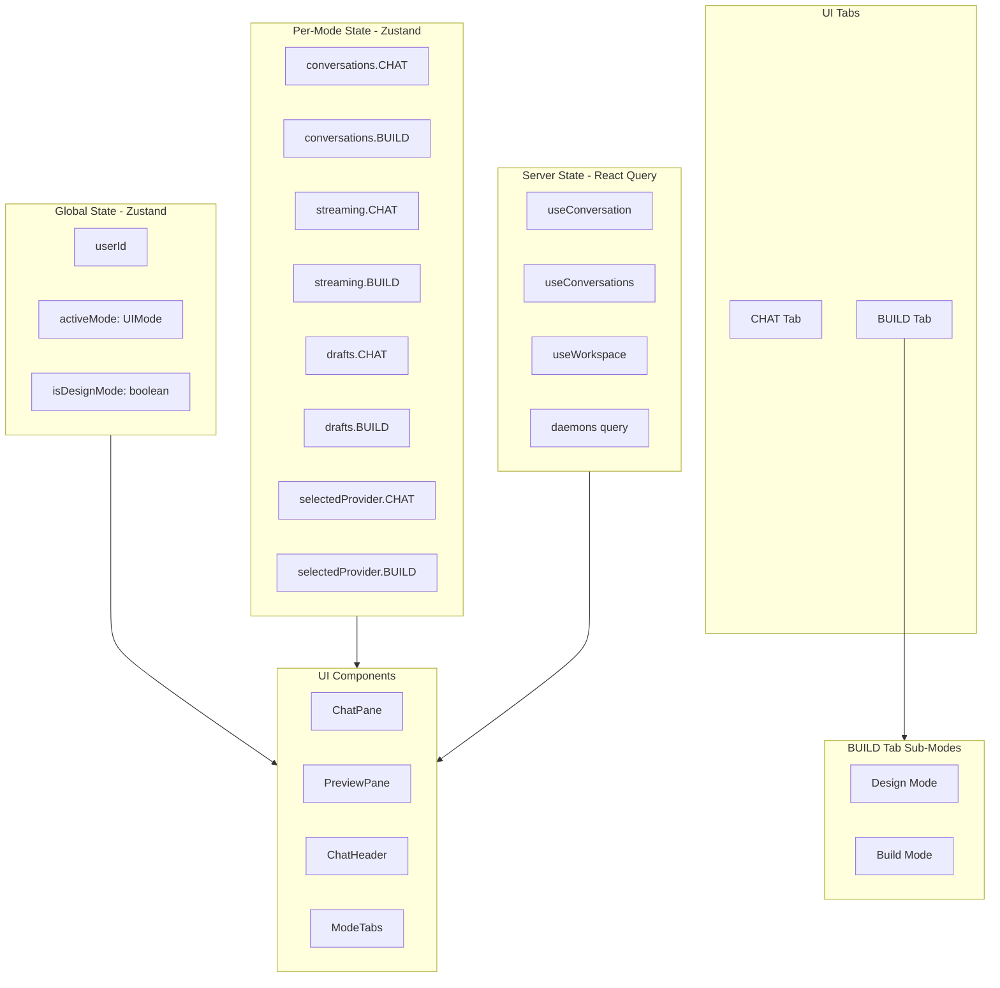
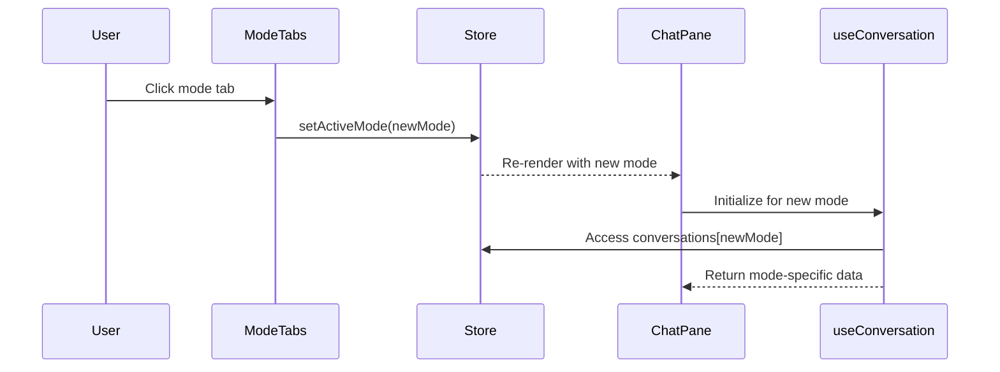
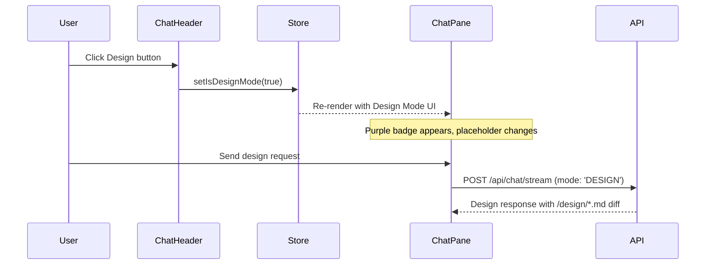
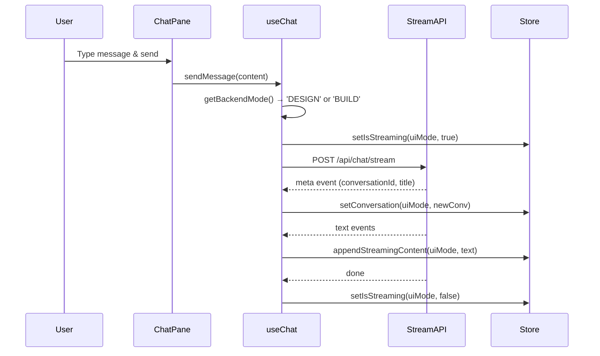

# State Management Architecture

This document describes the state management architecture for the AI Creator App, including the design decisions, data flow, and guidelines for extending the system.

## Overview

The application uses a hybrid state management approach:

1. **Zustand** - For global UI state and per-mode state that needs to persist across component unmounts
2. **React Query** - For server state (conversations, workspaces, daemons)
3. **Local React State** - For ephemeral UI state within components

## UI Mode Architecture

The application has **two UI tabs** but **three backend modes**:

| UI Tab | Backend Modes | Description |
|--------|--------------|-------------|
| **CHAT** | CHAT | General conversation and Q&A |
| **BUILD** | BUILD, DESIGN | Code generation and design planning |

The BUILD tab contains both BUILD and DESIGN as sub-modes:
- **BUILD Mode**: Active code generation, file manipulation, command execution
- **Design Mode**: Planning, architecture, design documentation (outputs to `/design/*.md`)

The `isDesignMode` flag in the store tracks which sub-mode is active within the BUILD tab.

## Architecture Diagram



## State Definitions

### Global State (Shared Across All Modes)

| State | Type | Description |
|-------|------|-------------|
| `userId` | `string \| null` | Anonymous user identifier |
| `activeMode` | `UIMode` | Currently active tab (CHAT or BUILD) |
| `isDesignMode` | `boolean` | Whether Design sub-mode is active (BUILD tab only) |
| `previewPanelOpen` | `boolean` | Whether preview panel is visible |
| `logsPanelOpen` | `boolean` | Whether logs panel is expanded |

### Per-Mode State (Isolated Per UI Mode)

| State | Type | Description |
|-------|------|-------------|
| `conversations[mode]` | `ConversationWithMessages \| null` | Current conversation for each UI mode |
| `streaming[mode]` | `{ isStreaming: boolean; content: string }` | Streaming state per UI mode |
| `drafts[mode]` | `string` | Unsent message draft per UI mode |
| `selectedProvider[mode]` | `Provider` | Selected AI provider per UI mode |
| `selectedModel[mode]` | `string` | Selected AI model per UI mode |

### Server State (React Query)

| Query | Scope | Description |
|-------|-------|-------------|
| `['conversation', mode]` | Per-mode | Fetches current conversation for mode |
| `['conversations', mode]` | Per-mode | Lists all conversations for mode (BUILD includes DESIGN) |
| `['workspace', workspaceId]` | BUILD only | Fetches workspace data |
| `['daemons', workspaceId]` | BUILD only | Lists running daemon processes |

## Type System

### UIMode vs Mode

```typescript
// Backend mode - includes DESIGN for database compatibility
export type Mode = 'CHAT' | 'DESIGN' | 'BUILD';

// UI-facing mode - only two tabs visible
export type UIMode = 'CHAT' | 'BUILD';

// Helper to map backend mode to UI tab
export function modeToUIMode(mode: Mode): UIMode {
  return mode === 'DESIGN' ? 'BUILD' : mode;
}
```

### Design Mode State

```typescript
// In Zustand store
isDesignMode: boolean;  // True when Design sub-mode is active in BUILD tab
setIsDesignMode: (isDesign: boolean) => void;
```

## Data Flow

### Mode Switching Flow



### Design Mode Toggle Flow



### Message Sending Flow (New Conversation)



### BUILD Mode Workspace Flow


## Mode Isolation

The key architectural decision is **mode isolation**. Each UI mode operates independently:

### Streaming Isolation

Streaming state is per-UI-mode:
```typescript
// ✅ Per-mode streaming
streaming: Record<UIMode, { isStreaming: boolean; content: string }>;

// Access in component
const { streaming } = useAppStore();
const { isStreaming, content } = streaming[mode];
```

### Workspace Isolation

Workspaces are only relevant to BUILD mode (including Design sub-mode):

```typescript
// In ChatPane
function useBuildModeWorkspace(mode: UIMode, workspaceId?: string | null) {
  // Only fetch workspace data for BUILD mode
  const workspaceHook = useWorkspace(mode === "BUILD" ? workspaceId : null);
  
  // Return null/no-op for CHAT mode
  return {
    workspace: mode === "BUILD" ? workspace : null,
    // ... other properties
  };
}
```

### Design Mode within BUILD

Design mode shares the same conversation and workspace as BUILD mode:

```typescript
// In useChat - determine backend mode from UI state
const getBackendMode = useCallback((): Mode => {
  if (uiMode === 'BUILD' && isDesignMode) {
    return 'DESIGN';  // Send DESIGN to backend
  }
  return uiMode;  // CHAT or BUILD
}, [uiMode, isDesignMode]);
```

## Project Documentation Structure

The AI agent manages documentation in the workspace:

```
/workspace
├── /design          # Design documents from Design Mode
│   └── {feature}.md
└── /tasks           # Build task lists from Build Mode
    └── {feature}-tasks.md
```

- **Design Mode**: Creates/updates `/design/{feature}.md` with architecture, requirements, decisions
- **Build Mode**: Creates/updates `/tasks/{feature}-tasks.md` with implementation TODOs

## Persistence Strategy

The following state is persisted to `localStorage` via Zustand's `persist` middleware:

| State | Persisted | Reason |
|-------|-----------|--------|
| `userId` | ✅ | Maintain user identity across sessions |
| `activeMode` | ✅ | Remember last used tab |
| `isDesignMode` | ✅ | Remember Design sub-mode state |
| `selectedProvider` | ✅ | Remember AI preferences |
| `selectedModel` | ✅ | Remember AI preferences |
| `previewPanelOpen` | ✅ | Remember UI layout |
| `drafts` | ✅ | Preserve unsent messages |
| `conversations` | ❌ | Fetched from server on load |
| `streaming` | ❌ | Ephemeral, reset on page load |

## Guidelines for Adding New State

### 1. Determine the Scope

Ask: "Is this state specific to a UI mode, or shared across all modes?"

- **Per-mode**: Add to the `Record<UIMode, T>` pattern
- **Global**: Add as a simple property

### 2. Determine the Source

Ask: "Is this state from the server, or purely client-side?"

- **Server state**: Use React Query
- **Client state**: Use Zustand or local React state

### 3. Determine Persistence

Ask: "Should this state survive a page refresh?"

- **Yes**: Add to `partialize` in the Zustand store
- **No**: Keep outside `partialize`

### 4. Example: Adding a New Per-Mode Feature

```typescript
// 1. Add to store interface
interface AppState {
  // ... existing state
  newFeature: Record<UIMode, NewFeatureState>;
  setNewFeature: (mode: UIMode, value: NewFeatureState) => void;
}

// 2. Initialize with defaults for all UI modes
newFeature: {
  CHAT: defaultValue,
  BUILD: defaultValue,
},

// 3. Create mode-aware setter
setNewFeature: (mode, value) =>
  set((state) => ({
    newFeature: {
      ...state.newFeature,
      [mode]: value,
    },
  })),

// 4. Access in component
const { newFeature } = useAppStore();
const currentValue = newFeature[mode];
```

## File Structure

```
lib/
├── store.ts              # Zustand store definition
├── hooks/
│   ├── useBootstrap.ts   # Initial app setup
│   ├── useChat.ts        # Chat messaging (per-mode)
│   ├── useConversation.ts # Single conversation management
│   ├── useConversations.ts # Conversation list
│   └── useWorkspace.ts   # Workspace management (BUILD only)
├── types.ts              # Type definitions (Mode, UIMode, etc.)
├── prompts/
│   ├── mode_switching_system_prompt.txt  # Core mode switching logic
│   ├── design_mode_guidance.txt          # Design mode instructions
│   └── build_mode_tasks_guidance.txt     # Build mode task tracking
└── ai/
    └── prompt-assembly.ts # Assembles system prompts per mode
```

## Testing Mode Isolation

To verify mode isolation is working:

1. **Streaming Test**: Start a message in BUILD mode, switch to CHAT mode. The streaming indicator should not appear in CHAT mode.

2. **Workspace Test**: The preview pane should only appear in BUILD mode. No workspace-related UI should appear in CHAT mode.

3. **Draft Test**: Type a message in CHAT mode, switch to BUILD mode. The draft should be preserved per-mode.

4. **Conversation Test**: Each UI mode maintains its own conversation history independently.

5. **Design Mode Test**: Click the Design button in BUILD mode. The purple badge should appear, and the backend should receive `mode: 'DESIGN'` in requests.

6. **Design to Build Transition**: In Design mode, when the agent asks "Ready to build?", clicking the BUILD button should switch to Build sub-mode and the purple badge should disappear.
